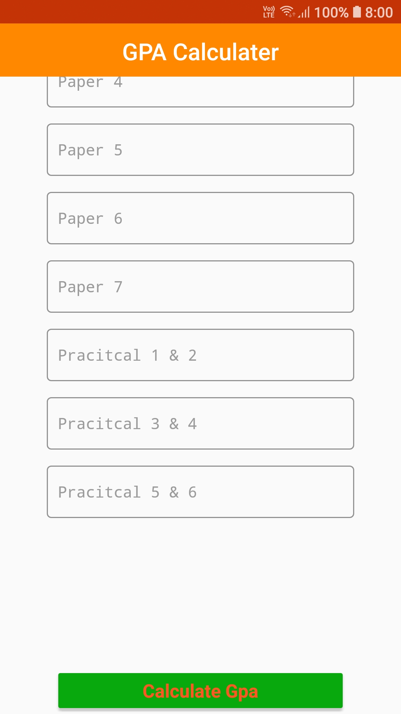

<h2 align="center"><b>GPA Calculator</b></h2>

        

### A GPA Calculator app idea Copy From 

## Screenshots

### Contribute To This Project By Folk!

# Download APK  

[Go To Release Page](https://github.com/shyamkumaryadav/gpacalculatorapp/releases) 

[Click me To Download](https://github.com/shyamkumaryadav/gpacalculatorapp/releases/download/v0.0.2/app-debug.apk)
